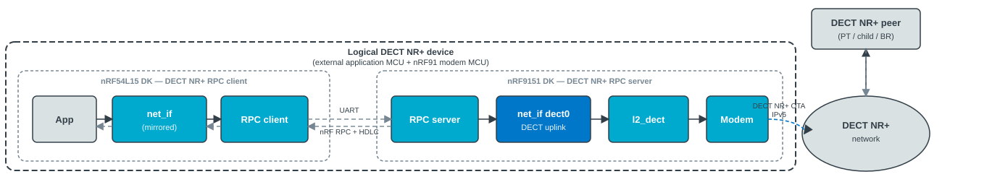
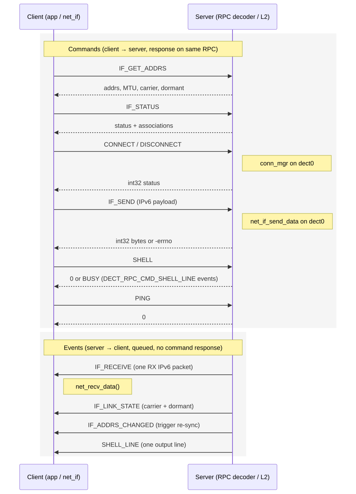

.. _dect_rpc:

DECT NR+ Remote Procedure Call
###############################

.. contents::
   :local:
   :depth: 2

The DECT NR+ Remote Procedure Call (RPC) solution lets an external MCU (without a DECT NR+ modem) control and exchange IPv6 traffic with the :ref:`ug_dect` stack running on another device.

.. note::
   The current implementation is :ref:`experimental <software_maturity>`.

Why use DECT NR+ RPC
********************

Run the DECT NR+ modem and DECT NR+ L2 on an nRF91 (server) and your product firmware on an external MCU (client).
That leaves more flash and RAM on the application chip for your code.
The DECT NR+ stack on the nRF91 is sizable but fits there; the client still gets a normal ``net_if`` over nRF RPC (typically UART).

You need two devices and accept UART latency and throughput limits compared with a single-chip design (see the :ref:`dect_rpc_sample`).

Overview
********

The solution allows an application on one device (the client) to use a DECT NR+ ``net_if`` and DECT NR+ shell commands that are actually served by the full DECT NR+ stack and modem running on a second device (the server).
This is accomplished by serializing IPv6 packets, shell commands, and status/link-state notifications, and sending them over a selected transport.
Use this when you want DECT NR+ connectivity on an external MCU without integrating the modem and full L2 stack into that firmware image.

Implementation
===============

DECT NR+ RPC consists of a client role, a server role, and shared common code (RPC group and helpers):

* Client — part of the application firmware on the external MCU; no DECT NR+ modem.
  Exposes a Zephyr network interface (``dect_rpc``) that serializes IPv6 send and receive, DECT NR+ shell commands, and status requests using :ref:`nrf_rpc`.
* Server — runs on nRF91 with DECT NR+ L2 and the DECT NR+ modem driver.
  Decodes RPC commands from the client, injects transmit packets into the DECT NR+ L2 send path, and forwards received traffic, link-state changes, and address changes back to the client.

Architecture
------------

The following figure shows the DECT NR+ RPC control and data path between the client and server.

   DECT NR+ RPC: one logical DECT NR+ device (dashed outline) with nRF54L15 DK (app + mirrored ``net_if``) and nRF9151 DK (modem and ``dect0``) linked by UART; the DECT NR+ network (IPv6 OTA) is outside that product boundary.

Client and server exchange two kinds of messages over the transport:

* Commands (client to server, blocking, with a response where applicable): :c:enumerator:`DECT_RPC_CMD_IF_SEND`, :c:enumerator:`DECT_RPC_CMD_IF_GET_ADDRS`, :c:enumerator:`DECT_RPC_CMD_IF_STATUS`, :c:enumerator:`DECT_RPC_CMD_CONNECT`, :c:enumerator:`DECT_RPC_CMD_DISCONNECT`, :c:enumerator:`DECT_RPC_CMD_SHELL`, :c:enumerator:`DECT_RPC_CMD_PING` (see :file:`subsys/net/dect/rpc/common/dect_rpc_ids.h`).
* Events (server to client, queued and sent one at a time): :c:enumerator:`DECT_RPC_CMD_IF_RECEIVE`, :c:enumerator:`DECT_RPC_CMD_IF_LINK_STATE`, :c:enumerator:`DECT_RPC_CMD_IF_ADDRS_CHANGED`, :c:enumerator:`DECT_RPC_CMD_SHELL_LINE`.

On the server, the L2 receive path (:c:func:`dect_net_l2_recv` in :file:`subsys/net/dect/l2/dect_net_l2.c`) forwards received IPv6 packets to the client instead of (not in addition to) handling them locally whenever a client is connected, so a given packet is only ever processed on one side.

RPC messages (commands, data, and events)
-----------------------------------------

The client sends commands; the server decodes, runs the handler, and sends a response on the same RPC transaction.
Application IPv6 traffic uses :c:enumerator:`DECT_RPC_CMD_IF_SEND` (positive response = accepted byte count, negative = errno).
The server sends events without a command-style response; client event decoders call :c:func:`nrf_rpc_decoding_done` so the transport can receive the next frame.

   Client-to-server commands (including :c:enumerator:`DECT_RPC_CMD_IF_SEND`) and server-to-client events.

Server L2 integration
---------------------

On the server, received IPv6 frames are handled in :c:func:`dect_net_l2_recv`, not in the modem RX driver alone.

When an RPC client session is active (refreshed on client commands, cleared after :kconfig:option:`CONFIG_DECT_NR_RPC_SERVER_CLIENT_IDLE_TIMEOUT_SEC` or RPC re-bind), the L2 layer calls the callback from :c:func:`dect_net_l2_rpc_forward_register`, releases the packet locally, and enqueues a :c:enumerator:`DECT_RPC_CMD_IF_RECEIVE` event for the client (:c:func:`dect_net_l2_rpc_client_set_connected` gates forwarding).
When no client session is active, the server processes packets on ``dect0`` as usual.

Link-state and IPv6 address or prefix changes on the server ``dect0`` interface invoke the callback from :c:func:`dect_net_l2_link_state_register` and are mirrored to the client with :c:enumerator:`DECT_RPC_CMD_IF_LINK_STATE` and :c:enumerator:`DECT_RPC_CMD_IF_ADDRS_CHANGED` events.

For :c:enumerator:`DECT_RPC_CMD_IF_SEND`, the server builds a :c:struct:`net_pkt` on the DECT modem interface (typically ``dect0``), derives the DECT destination from the IPv6 destination address, and injects the packet with :c:func:`net_if_send_data` into the L2 send path.
The RPC command response (accepted byte count or negative errno) is sent before the blocking DECT transmit completes.

Client network interface
------------------------

The client does not build DECT NR+ L2 or the modem driver; it registers a dedicated L2 and a ``dect_rpc`` ``net_if`` only.

The client interface uses :c:macro:`NET_IF_IPV6_NO_ND`: addresses, prefixes, MTU, carrier, and dormant state come from :c:enumerator:`DECT_RPC_CMD_IF_GET_ADDRS` and :c:enumerator:`DECT_RPC_CMD_IF_LINK_STATE` RPC messages, not from Neighbor Discovery on the client.

With :kconfig:option:`CONFIG_NET_IPV6_MLD`, multicast behavior aligns with native DECT where applicable (including optional deferred join of ``ff02::fb`` when carrier is up).
Use different hostnames on the client and server so the client does not impersonate the server's mDNS identity on the DECT side.

Command and event numeric IDs (:c:enum:`dect_rpc_cmd_server`, :c:enum:`dect_rpc_cmd_client`) are defined in :file:`subsys/net/dect/rpc/common/dect_rpc_ids.h`.
The overview above names the messages used on the wire; add or rename IDs in that header only (Doxygen picks up the enums).

Requirements
************

The solution requires:

* :ref:`nrf_rpc` (:kconfig:option:`CONFIG_NRF_RPC`, :kconfig:option:`CONFIG_NRF_RPC_CBOR`)
* IPv6 networking (:kconfig:option:`CONFIG_NET_IPV6`) on both client and server
* DECT NR+ L2 (:kconfig:option:`CONFIG_NET_L2_DECT`) and a DECT NR+ modem driver on the server only

Configuration
*************

Enable :kconfig:option:`CONFIG_DECT_NR_RPC` and select the role on each image (``DECT NR+ over RPC role`` in menuconfig):

* :kconfig:option:`CONFIG_DECT_NR_RPC_CLIENT` — external MCU (mirrored ``net_if``, no DECT NR+ modem)
* :kconfig:option:`CONFIG_DECT_NR_RPC_SERVER` — nRF91 with :kconfig:option:`CONFIG_NET_L2_DECT` and modem

Connect the boards with UART nRF RPC (:kconfig:option:`CONFIG_NRF_RPC_UART_TRANSPORT`, devicetree ``nordic,rpc-uart``).
The tunneled client ``net_if`` and server RPC bridge (:kconfig:option:`CONFIG_DECT_NR_RPC_NET_IF`, default enabled) must stay enabled on both images for the usual client/server link.
See :ref:`nrf_rpc` for UART buffer sizes, group init initiator, and response timeout (the :ref:`dect_rpc_sample` ``prj.conf`` / :file:`server.conf` show typical values).

Application-facing options (same menu), as used in :ref:`dect_rpc_sample`:

**Client image** (``prj.conf``):

* :kconfig:option:`CONFIG_DECT_NR_RPC_CLIENT_IFACE_NAME` — logical name for the tunneled interface (sample: ``dect0``)
* :kconfig:option:`CONFIG_DECT_NR_RPC_CONN_MGR` — ``dect connect`` / ``dect disconnect`` proxied to server ``dect0``
* :kconfig:option:`CONFIG_DECT_NR_RPC_CLIENT_SHELL` — ``dect status``, ``dect sync``, ``dect run``, and related commands

**Server image** (:file:`server.conf`):

* :kconfig:option:`CONFIG_DECT` and DECT NR+ modem/L2 stack (see sample)
* :kconfig:option:`CONFIG_DECT_NR_RPC_SHELL` — remote L2 shell over RPC (``dect run`` on the client)
* :kconfig:option:`CONFIG_NET_L2_DECT_CONN_MGR` and ``NET_L2_DECT_CONN_MGR_*`` — association policy on real ``dect0`` (not on the client tunnel)

Optional client fragments in the sample tree (``ping.conf``, ``dns.conf``, ``rpc-large-rx.conf``) add ping, DNS, or larger UART RX buffers; they do not change the core RPC role options above.

All other ``CONFIG_DECT_NR_RPC_*`` symbols (auto-sync timing, max tunneled IPv6 size, server event queue, idle session timeout, shell RPC init when :kconfig:option:`CONFIG_NRF_RPC_INIT` is off, logging) are documented in :file:`subsys/net/dect/rpc/Kconfig`.

Usage
*****

Bring-up matches :ref:`dect_rpc_sample` (RPC init in :c:func:`main`, not auto :kconfig:option:`CONFIG_NRF_RPC_INIT`):

**Boot order:** Reset the **client** first until it waits for the server, then reset the **server** (after ``nrf_modem_lib_init()`` on the server, then :c:func:`nrf_rpc_init` on both sides).

**Client** (tunneled interface name from :kconfig:option:`CONFIG_DECT_NR_RPC_CLIENT_IFACE_NAME`, sample ``dect0``):

1. Register :c:func:`nrf_rpc_set_bound_handler` and call :c:func:`nrf_rpc_init` (wait until the handler reports :c:func:`dect_rpc_client_get_group` bound).
2. Call :c:func:`dect_rpc_client_notify_rpc_init_done` so :kconfig:option:`CONFIG_DECT_NR_RPC_AUTO_SYNC` can pull addresses from the server and bring the interface up (or run ``dect sync`` manually if auto-sync is off).
3. Use the Zephyr networking APIs on that interface, or ``dect`` shell commands (``dect status``, ``dect sync``, ``dect connect``, ``dect run <subcmd> [args...]``—not ``dect run status`` for status).

**Server:** ``nrf_modem_lib_init()`` then :c:func:`nrf_rpc_init`; real DECT traffic uses modem ``dect0`` (see sample :file:`server.conf`).

Shell over RPC
--------------

When :kconfig:option:`CONFIG_DECT_NR_RPC_SHELL` and :kconfig:option:`CONFIG_DECT_NR_RPC_CLIENT_SHELL` are enabled, the client can run DECT NR+ L2 shell subcommands on the server with ``dect run <subcmd> [args...]``.
The command RPC response carries status only (0 OK, 1 error or ``BUSY``); printable output is delivered in :c:enumerator:`DECT_RPC_CMD_SHELL_LINE` events on the client.
If the server's local shell is running a DECT command, RPC shell returns ``BUSY`` (the local shell always wins).

Use ``dect status`` (:c:enumerator:`DECT_RPC_CMD_IF_STATUS`) and ``dect sync`` for structured status and address sync—not ``dect run status``.
Use the ``ping`` shell on the client ``dect0`` interface (sample :file:`ping.conf`), not ``dect run ping``.

Samples using the library
*************************

The following |NCS| sample uses this library:

* :ref:`dect_rpc_sample`

Security
********

DECT NR+ RPC is intended for a trusted environment: a private link (typically UART) between your application MCU and the nRF91 that runs the DECT NR+ stack.

There is no authentication or encryption: valid :ref:`nrf_rpc` on the link is treated as the RPC client (tunneled IPv6 and, if enabled, remote shell).
The UART checksum is for framing integrity only.

Because the feature is :ref:`experimental <software_maturity>`, plan on API and protocol changes before any field deployment.
For integration and lab use, keep the RPC link on-board only (not on external connectors) and disable shell-over-RPC unless you need it for bring-up.

Malformed or oversized CBOR payloads are rejected or truncated where possible: tunneled IPv6 size is capped by :kconfig:option:`CONFIG_DECT_NR_RPC_MAX_IP_PKT` on both roles, and the client skips address/status fields beyond fixed decode limits so responses stay in sync with the wire format.

Limitations
***********

The solution has the following limitations:

* Only one client can be connected to a server at a time.
* When a client is connected, the server no longer performs local child or multicast routing on ``dect0`` for packets forwarded to the client; the server acts as a modem for that client instead of also routing those packets locally on the nRF91.
* Long-running shell commands issued from the client (for example a DECT NR+ scan) block the server's RPC handling until they finish.
* Verbose shell output (many :c:enumerator:`DECT_RPC_CMD_SHELL_LINE` events) may require longer :kconfig:option:`CONFIG_NRF_RPC_RESPONSE_TIMEOUT` and larger UART RX buffers on both roles.
* Only :c:macro:`AF_INET6` raw IPv6 traffic is tunneled; there is no additional encapsulation beyond CBOR framing.

Dependencies
************

The solution depends on:

* :ref:`nrf_rpc`
* :ref:`ug_dect`

API documentation
*****************

DECT NR+ RPC is primarily used through the Zephyr networking API on the client's ``dect_rpc`` network interface and through the ``dect`` shell commands.

The public C header documents only RPC bring-up hooks for applications that call :c:func:`nrf_rpc_init` themselves (see the :ref:`dect_rpc_sample` client :c:func:`main`).

Client API (see :file:`include/net/dect/dect_rpc.h`):

* :c:func:`dect_rpc_client_get_group`
* :c:func:`dect_rpc_client_notify_rpc_init_done`
* :c:func:`dect_rpc_client_ping`

Server L2 hooks (see :file:`include/net/dect/dect_net_l2_rpc.h`):

* :c:func:`dect_net_l2_rpc_forward_register`
* :c:func:`dect_net_l2_link_state_register`
* :c:func:`dect_net_l2_rpc_client_set_connected`

Address sync, connect, and disconnect are handled by the subsystem (auto-sync, ``dect`` shell, conn_mgr) and are not additional public C entry points.

| Header file: :file:`include/net/dect/dect_rpc.h`
| Source files: :file:`subsys/net/dect/rpc/` (``common/``, ``client/``, ``server/``); server L2 in :file:`subsys/net/dect/l2/dect_net_l2.c`
| RPC command IDs: :file:`subsys/net/dect/rpc/common/dect_rpc_ids.h` (:c:enum:`dect_rpc_cmd_server`, :c:enum:`dect_rpc_cmd_client`)

The nRF RPC group name is ``"dect_rpc"``.
UART transport is selected with :kconfig:option:`CONFIG_DECT_NR_RPC_UART_TRANSPORT` (typical for the sample).

.. doxygengroup:: dect_rpc
